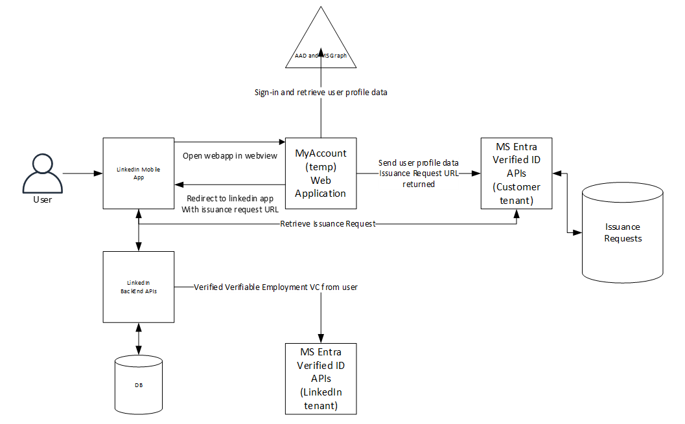

Verified Employee Issuance Readme

- Architecture overview
- [Setup and deploy instructions](ReadmeFiles/Deployment.md)
- [Test your deployed web application](ReadmeFiles/TestApplication.md)

# Architecture overview

Below are the high-level steps for LinkedIn integration:
1.	User starts the LinkedIn mobile app. 
2.	The mobile app retrieves information from the LinkedIn backend and checks if the company is enabled for the pilot and it also retrieves a URL to the myaccount website.
3.	If the company is enabled, the user can tap on the verify employment link and the user is send to the myaccount website in a web view
4.	The user needs to provide their corporate credentials to sign in.
5.	The webapp retrieves the user profile from MS (Microsoft Security) Graph, firstname, lastname, displayname, jobtitle, upn, email and photo and shows this to the user on the screen.
6.	When the users click the ‘retrieve my verified id’ button the webapp calls the Microsoft Entra Verified ID service with the profile information.
7.	The MS Entra Verified ID service creates a verifiable credentials issuance request and returns the URL to that specific request
8.	The webapp redirects back to the LinkedIn app with the specific URL retrieved in step 2.
9.	LinkedIn app wallet communicates with the MS Entra Verified ID services to get the Verified Employment VC issued in their wallet part of the LinkedIn mobile app.
10.	The LinkedIn app then verifies the received verifiable credential.
11.	If the verification is completed, they change the status to verified in their backend system.

The diagram below shows the dataflow of the entire solution.

## Configuration considerations
The webapp is a ASP.Net core 6 application. It uses Microsoft.Identity.Web and the MS Graph SDK to create access tokens and retrieve the users profile information. When configured to use Managed Identities it will use the Managed Identity SDK to get access tokens to the VC Service. The application is designed to use as little memory as possible and by default uses an in-memory token cache. If the webapp needs more scale, you could consider using Redis for token cache and session cache. Documentation can be found here:

At the end of the document, we discuss different ways of configuring and deploying the web application. For the initial setup it follows best practices with an app registration using certificates in keyvault and a managed identity for app to app access tokens, assuming the users, the web app and the VC Service are all in the same tenant.
