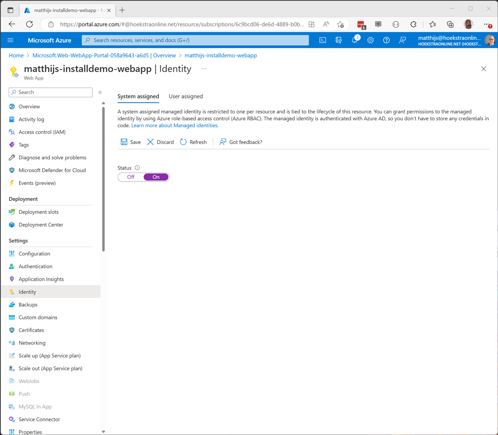

# Setup and deploy the webapp to Azure
The custom webapp needs to be deployed in your environment. In this document, we are sharing the best practices for Azure deployments. If you need to deploy it to another environment that works as well. You would need to use app secrets or certs and configure the deployment with the best practices of that environment.

The web application can be configured in several ways. This guidance describes how to deploy it to azure web apps and uses a Managed Identity to create access tokens to communicate to the MS Entra Verified ID Service.

Prerequisites:
1.	Verified ID Service setup is completed. We need the DID of the VC service.
2.	Verified Employment Verified ID credential is created through the wizard. (We need the manifest URL of the Verified Employee contract)
3.	Visual Studio, VS Code or .NET installed on the device to publish the application.
4.	Azure subscription with permission to deploy azure web apps.
5.	Downloaded code repo from https://github.com/Azure-Samples/VerifiedEmployeeIssuance
6.	Make sure you have installed the Azure CLI on your machine. You can find instructions on how to do that here: https://docs.microsoft.com/en-us/cli/azure/install-azure-cli

These are the steps needed to complete the deployment of the web application:
1.	Create resource group.
2.	Create App Services plan.
3.	Create web application this will host the webapp.
4.	Create key vault to store the certificate the app uses to sign in the service principal.
5.	Create an app registration. This allows users to sign-in
6.	Add certificates to app registration.
7.	Setup permissions to the managed identity
8.	Configure the web application.
9.	Deploy the web app.
Before completing these steps, we assume the VC Service is set up, and the Verified Employee ID is configured. We need the DID of the VC service and the manifest URL of the Verified Employee contract.

## 1. Create resource group
[Create a resource group - Microsoft Azure](https://ms.portal.azure.com/#create/Microsoft.ResourceGroup)

## 2 Create App Services plan
[Create App Service Plan - Microsoft Azure](https://ms.portal.azure.com/#create/Microsoft.AppServicePlanCreate)

Select the appropriate pricing plan for your expected capacity. 

## 3 Create Web application
[Create Web App - Microsoft Azure](https://ms.portal.azure.com/#create/Microsoft.WebSite)

Select Code - .NET 6 (LTS) and Linux or Windows as OS.

After creation go to resource and **copy** the default domain URL value. It will be the `https://webappname.azurewebsites.net` we need this value later.


Navigate to Identity and set status to On and click save to enable the managed identity for this webapp.



## 4 Create KeyVault
[Create a key vault - Microsoft Azure](https://ms.portal.azure.com/#create/Microsoft.KeyVault)

To store the certificate for the application (created in the next step) we need a keyvault. Copy the Vault URL of the keyvault. We need this later in the configuration step.


After the KeyVault is created we need to grant permissions to the managed identity of the web app we just created.

Navigate to Access policies.


Click on Create and select the **Get** permissions under Secret permissions and **Get, List** permissions under Certificate permissions


On the next page you can select which principal needs permissions. Search for the webapp name you created. This name will only appear if you have enabled the managed identity.


Navigate to Certificates.


Click on Generate/Import.

Fill in a Certificate Name and Subject and click Create. Write down the Certificate Name.


Select the certificate. You want to wait until the cert is under completed and not under the in-progress category.


Select the current version.


Click Download in CER format.

We need this CER file in our app registration.

## 5 Create application registration
To allow users to sign-in we need an application registration in Azure Active Directory.
[Register an application - Microsoft Azure](https://ms.portal.azure.com/#view/Microsoft_AAD_RegisteredApps/CreateApplicationBlade/quickStartType~/null/isMSAApp~/false)


In the Redirect URI choose Web as platform and copy paste the URL from the webapp with /**signin-oidc** added to the URL. The URL should start with https://
Click Register

Copy the Application (client) ID and the Directory (tenant) ID.

If you navigate to API permissions the screen should look like this:


The application needs the **User.Read** permissions. You can Grant Admin consent here to prevent a consent window shown to the users or in some cases the tenant might be configured so every permission needs to be consented by an admin. The default for user.read is a user can consent the permissions. The first time a user will sign in they will see a screen like this:

### Add certificate to application registration
Navigate to Certificates & secrets and select Certificates.


Select upload certificate. Select the CER file you downloaded and click Add.

Your screen should look like this:


## 6 Setup permissions for the managed Identity
Currently there is no UI to modify the permissions of the managed identity. We need a PowerShell script to modify this.

Run the following PowerShell script with your tenant ID and the name of the managed identity (this is the webapp name you used previously)

```
$TenantID="<YOUR TENANTID>"
$DisplayNameOfMSI="<NAME OF THE MANAGED IDENTITY FROM YOUR AZURE WEBAPP>"

#Do not change this values below
#
$ApiAppId = "3db474b9-6a0c-4840-96ac-1fceb342124f"
$PermissionName = "VerifiableCredential.Create.IssueRequest"
 

# Install the module
Install-Module AzureAD

Connect-AzureAD -TenantId $TenantID

$MSI = (Get-AzureADServicePrincipal -Filter "displayName eq '$DisplayNameOfMSI'")

Start-Sleep -Seconds 10

$ApiServicePrincipal = Get-AzureADServicePrincipal -Filter "appId eq '$ApiAppId'"
$AppRole = $ApiServicePrincipal.AppRoles | Where-Object {$_.Value -eq $PermissionName -and $_.AllowedMemberTypes -contains "Application"}
New-AzureAdServiceAppRoleAssignment -ObjectId $MSI.ObjectId -PrincipalId $MSI.ObjectId ` -ResourceId $ApiServicePrincipal.ObjectId -Id $AppRole.Id
```
A straightforward way to do this is from the azure portal Cloud Shell.


You can now navigate to Azure Active Directory, Enterprise applications.
[Enterprise applications - Microsoft Azure](https://ms.portal.azure.com/#view/Microsoft_AAD_IAM/StartboardApplicationsMenuBlade/~/AppAppsPreview/menuId~/null)

Clear the filter for Application type == Enterprise applications

Search for your web app name.


In the permissions screen you should see the managed identity has permissions to issuer Verifiable Credentials.


## 7 Web application configuration
This step will configure the web app with all the settings we noted down during the steps before.

There are a few ways to configure an application. The easiest way is to modify the appsettings.json file and deploy that with your application. It is also possible to override any of that config through configuration in the azure portal on the configuration page of the webapp. It is highly recommended to make the configuration through the configuration settings instead of directly in the appsettings.json. For the webapp there is no difference. For clarity we will discuss the settings through the appconfiguration.json file.

Your config should look something like this:
```
  "AzureAd": {
    "Instance": "https://login.microsoftonline.com/",
    "Domain": "<YOUR USERS DOMAIN>",
    "TenantId": "<YOUR TENANT ID>",
    "ClientId": "<YOUR CLIENT ID>",
    "CallbackPath": "/signin-oidc",

    //recommended to use KeyVault for certificates
    "ClientCredentials": [
      {
        "SourceType": "KeyVault",
        "KeyVaultUrl": "https://<YOUR KEYVAULT>.vault.azure.net/",
        "KeyVaultCertificateName": "<YOUR CERTIFICATENAME>"
      }
    ]
  },
```
The part for the Verified ID service looks like this:
```
"VerifiedIDService": {
    //this is the recommend and default deployment model for azure webapps
    //user a managed identity to access the VC service, make sure you configured the service principal with the correct permissions
    //
    "SourceType": "SignedAssertionFromManagedIdentity",

    "Endpoint": "https://verifiedid.did.msidentity.com/v1.0/",
    "VCServiceScope": "3db474b9-6a0c-4840-96ac-1fceb342124f/.default"
  },
```  
And the last bit is your configuration for your Verified Employee credential and Authority
```
  "VerifiedEmployeeId": {
    "manifest": "MANIFEST URL FROM YOUR VERIFIED EMPLOYEE CONTRACT",
    "Authority": "YOUR VC SERVICE AUTHORITY/DID"
  },
```
If you want to configure the app through web app configuration navigates to your created web app and select configuration on the left-hand side.


Select configuration and click on Advanced Edit. Replace the configuration with this and replace the values with your own noted values:
```
[
  {
    "name": "AzureAd__ClientCredentials__0__KeyVaultCertificateName",
    "value": "<CERTIFICATE NAME>",
    "slotSetting": false
  },
  {
    "name": "AzureAd__ClientCredentials__0__KeyVaultUrl",
    "value": "<KEYVAULT-URL-INCLUDING HTTPS://>",
    "slotSetting": false
  },
  {
    "name": "AzureAd__ClientCredentials__0__SourceType",
    "value": "KeyVault",
    "slotSetting": false
  },
  {
    "name": "AzureAd__ClientId",
    "value": "<YOUR CLIENTID>",
    "slotSetting": false
  },
  {
    "name": "AzureAd__Domain",
    "value": "<YOUR DOMAIN>",
    "slotSetting": false
  },
  {
    "name": "AzureAd__TenantId",
    "value": "<YOUR TENANTID>",
    "slotSetting": false
  },
  {
    "name": "VerifiedEmployeeId__Authority",
    "value": "<YOUR VC AUTHORITY>",
    "slotSetting": false
  },
  {
    "name": "VerifiedEmployeeId__manifest",
    "value": "<YOUR VERIFIED EMPLOYEE VC MANIFEST URL>",
    "slotSetting": false
  },
  {
    "name": "VerifiedIDService__SourceType",
    "value": "SignedAssertionFromManagedIdentity",
    "slotSetting": false
  }
]
```
Save the configuration.

## 8 Deploying the Web application
### Deploy with Visual Studio
Navigate to the code repository on your machine and open the solution with Visual Studio

Right click on the project and select publish

Click on New to add a publishing profile. Select Azure, click Next.

Select Azure App Service (Linux or Windows)

Select your subscription, resource group and web app you just created. Click Finish.

Now click Publish to publish the web application to Azure. This will recompile the app, build the artifacts and push it to Azure. After this is completed, it is time to test the deployment.
### Deploying the Web application from the command line.
Navigate to the code repository in a PowerShell core command window.

Type `dotnet build -c release`

This should result in the application being compiled.

Type `dotnet publish –configuration Release`

Type `Compress-Archive bin\release\net6.0\publish\* -DestinationPath bin\release\releasepackage.zip` to create the zip file with the solution.

Make sure az CLI is installed from:[https://learn.microsoft.com/en-us/cli/azure/install-azure-cli](https://learn.microsoft.com/en-us/cli/azure/install-azure-cli)

Type `az login` Optionally you can use `az login –tenant <YOUR TENANT>`

Type `az account set –subscription <SUBSRIPTION ID>` to specify which azure subscription to use

Type `az webapp deploy --resource-group "<RESOURCE GROUP NAME>" --name "<WEBAPP NAME>" --src-path ".\bin\release\releasepackage.zip"`


You are now ready to [test](TestApplication.md) your application.
