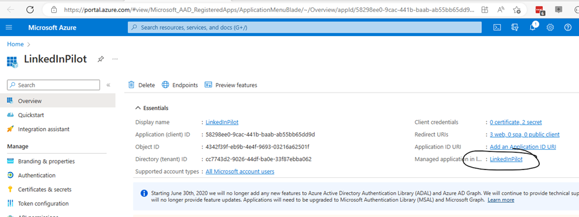

# Granting access to a specific set of users

The application allows you to assign a specific set of users to get access to the webapp. There are 2 different ways of doing this. 

## Assign access to the enterprise app
The easiest way is to change the Enterprise application for your webapp. If you navigate to the app registration page:



Click on the Managed Application in local directory link and change the Assignment required on the properties page:


When this setting is made, the users who need access need to be granted access through the Users and Groups page described here: [Assign users and groups - Microsoft Entra | Microsoft Learn](https://learn.microsoft.com/en-us/azure/active-directory/manage-apps/assign-user-or-group-access-portal?pivots=portal)

The disadvantage of this configuration is the users who are not part of your pilot will see the following error message when they try to verify themselves from the LinkedIn mobile app:


## Assign access to through an application role
To be able to show a custom error message to your users the webapp supports assigning users to app roles. Instead of using assign permissions from the previous chapter you can add an application role in the app registration page.


Once the app role is configured. Remember the name. This needs to be configured in the azure portal as configuration of your azure webapp or through appsettings.json 

```AzureAd__AllowedUsersRole``` with the correct rolename

or through appsettings.json

```
"AzureAd": {
    "AllowedUsersRole": "LinkedInPilotUser",
```

You can now directly configure users and groups (do not set the user assignment required setting) in the enterprise app and make sure the users or the distribution group is assigned to the app role we just configured.


When a user tries to get verified and is not part of the pilot, they will see this error message on their mobile device:


If you want to change the error message and link to an internal resource for your users, you can easily modify the AccessDenied.cshtml file in the Pages directory of the solution. Line 16 and 17 can be uncommented and modified to your needs.
