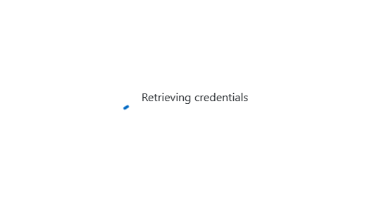
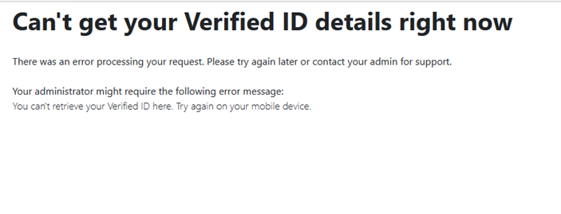
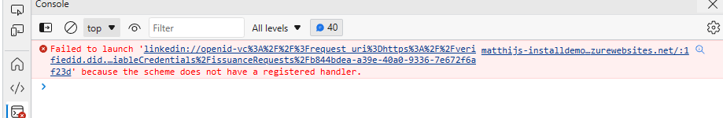

# Test your deployment

Easiest is to navigate to `https://<your webapp url>/issue` this should allow you to sign in and show your profile data. If this is working the first part of the configuration is done correctly. If you press the button and a QR code is shown the security setup is working 100%. If you can scan the QR code and issue yourself a VC in Authenticator the VC service is working and the configuration of the webapp is complete.

When you launch the website on your desktop you should see this screen after a sign-in:

A few seconds later this screen should show:

This is expected since the webapp tries to redirect to linkedin:// which is not possible on a desktop. If you check the console in the browser developer tools, you will see this message:

This means the app is working correctly.